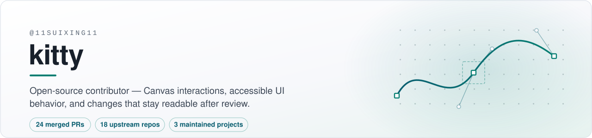

<picture>
  <source media="(prefers-color-scheme: dark)" srcset="assets/header-dark.svg">
  
</picture>

I work on TypeScript and React codebases where the hard part is interaction: pointer
handling on Canvas, focus and keyboard behavior, and packaging boundaries. Most of what
I send upstream is small on purpose — a reproducible failure, the narrowest fix for it,
and regression coverage that explains why the fix is there.

Longer build logs and engineering notes live on the
[blog](https://11suixing11.github.io/homepage/).

## Maintained

| Project | What it does | Stack | Release |
| :--- | :--- | :--- | :--- |
| [**mindnotes-pro**](https://github.com/11suixing11/mindnotes-pro) | Local-first whiteboard: offline drawing, no account, internals meant to be read | React · TypeScript · Canvas · Zustand | [v5.0.1](https://github.com/11suixing11/mindnotes-pro/releases/tag/v5.0.1) |
| [**know-yourself**](https://github.com/11suixing11/know-yourself) | Bilingual self-reflection platform — 16 curated assessments, guest data never leaves the device | TypeScript · local-first | [v0.2.1](https://github.com/11suixing11/know-yourself/releases/tag/v0.2.1) |
| [**github-maintainer-agent**](https://github.com/11suixing11/github-maintainer-agent) | Human-paced multi-agent maintenance controller with an operational console | Python | — |

## Merged upstream

24 pull requests across 18 repositories. Six of them, ordered by how much traffic the
project carries:

| Project | ★ | PR | Change |
| :--- | ---: | :--- | :--- |
| [plait-board/drawnix](https://github.com/plait-board/drawnix) | 14.6k | [#449](https://github.com/plait-board/drawnix/pull/449) | Middle-mouse panning inside freehand tools, through two review rounds |
| [szimek/signature_pad](https://github.com/szimek/signature_pad) | 12.0k | [#890](https://github.com/szimek/signature_pad/pull/890) | Correct rendering for two-point point groups on the maintained canvas path |
| [mdx-editor/editor](https://github.com/mdx-editor/editor) | 3.6k | [#952](https://github.com/mdx-editor/editor/pull/952) | Markdown heading shortcuts respect the configured heading levels |
| [felladrin/MiniSearch](https://github.com/felladrin/MiniSearch) | 586 | [#2218](https://github.com/felladrin/MiniSearch/pull/2218) | Image thumbnails reachable and operable from the keyboard |
| [mattenarle10/markamd](https://github.com/mattenarle10/markamd) | 469 | [#127](https://github.com/mattenarle10/markamd/pull/127) | Active-file reloads survive immediate watcher events |
| [hanishrao/collective-ai-tools](https://github.com/hanishrao/collective-ai-tools) | 230 | [#279](https://github.com/hanishrao/collective-ai-tools/pull/279) | PatternStudio controls stay visible on touch |

<b>The other 18 merged pull requests</b>

| Project | PR | Change |
| :--- | :--- | :--- |
| [kulcsarrudolf/zimme-zoom](https://github.com/kulcsarrudolf/zimme-zoom) | [#47](https://github.com/kulcsarrudolf/zimme-zoom/pull/47) | Portal the PhotoViewer and hide background content from assistive tech |
| kulcsarrudolf/zimme-zoom | [#44](https://github.com/kulcsarrudolf/zimme-zoom/pull/44) | Interaction coverage for the PhotoViewer |
| kulcsarrudolf/zimme-zoom | [#43](https://github.com/kulcsarrudolf/zimme-zoom/pull/43) | CI guards for bundle size and tree shaking, on Node 20 |
| kulcsarrudolf/zimme-zoom | [#42](https://github.com/kulcsarrudolf/zimme-zoom/pull/42) | Report download fallback results instead of failing silently |
| [mattenarle10/markamd](https://github.com/mattenarle10/markamd) | [#126](https://github.com/mattenarle10/markamd/pull/126) | Publish the updater manifest with public download URLs |
| [calcom/companion](https://github.com/calcom/companion) | [#159](https://github.com/calcom/companion/pull/159) | Align README scripts with the workspace layout |
| calcom/companion | [#157](https://github.com/calcom/companion/pull/157) | Run pre-commit hooks from the repository root |
| [tiagolauer/OwlSQL](https://github.com/tiagolauer/OwlSQL) | [#208](https://github.com/tiagolauer/OwlSQL/pull/208) | Return write metadata from the node-sqlite driver |
| tiagolauer/OwlSQL | [#207](https://github.com/tiagolauer/OwlSQL/pull/207) | Ignore dollar-quoted strings when detecting placeholder style |
| [Opndrive/opndrive](https://github.com/Opndrive/opndrive) | [#117](https://github.com/Opndrive/opndrive/pull/117) | Unskip the bring-your-own-S3 coverage |
| [Ishannaik/warp](https://github.com/Ishannaik/warp) | [#166](https://github.com/Ishannaik/warp/pull/166) | Cap text snippet payloads on the peer channel |
| [hariharapanigrahy/layerkit](https://github.com/hariharapanigrahy/layerkit) | [#126](https://github.com/hariharapanigrahy/layerkit/pull/126) | Fail closed on HTTP redirects in the delivery path |
| [devi5040/scaffinity](https://github.com/devi5040/scaffinity) | [#32](https://github.com/devi5040/scaffinity/pull/32) | Explain malformed blueprint JSON instead of aborting |
| [stacktale/stacktale-vscode](https://github.com/stacktale/stacktale-vscode) | [#10](https://github.com/stacktale/stacktale-vscode/pull/10) | Show click feedback and the log path when a report opens |
| [source-academy/conductor](https://github.com/source-academy/conductor) | [#58](https://github.com/source-academy/conductor/pull/58) | Make module initialisation idempotent |
| [mcclowes/reqon](https://github.com/mcclowes/reqon) | [#274](https://github.com/mcclowes/reqon/pull/274) | Validate batch keys before fallback writes |
| [Zacxxx/canwesynth](https://github.com/Zacxxx/canwesynth) | [#11](https://github.com/Zacxxx/canwesynth/pull/11) | Cover Wine prefix detection in the installer |
| [Xquik-dev/x-twitter-scraper-typescript](https://github.com/Xquik-dev/x-twitter-scraper-typescript) | [#21](https://github.com/Xquik-dev/x-twitter-scraper-typescript/pull/21) | Type-check the README quickstart, carried through dependency-audit and DCO review |

## How I work

- Small, reviewable changes with a stated reason. If I cannot say why a diff exists, it does not go out.
- Reproduce first, cover the reproduction, then widen scope — not the other way round.
- Answers go on the review thread that raised the question.
- Project conventions and scope boundaries are part of the implementation, not overhead.
- I cap external work at three concurrent PRs and one open PR per upstream repository, unless a maintainer asks for a split.

## Elsewhere

[Blog](https://11suixing11.github.io/homepage/) · [Blog source](https://github.com/11suixing11/homepage) ·
engineering notes, build logs, and maintenance writing ·
based in China, working in English or Chinese.

The fastest way to reach me about a project is an issue with a minimal reproduction.
